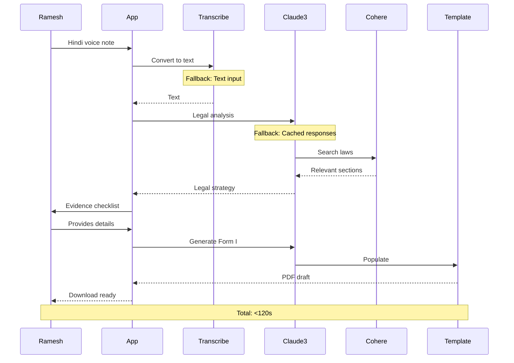

# Citadel AI: System Design Document
## Engineering Justice at Scale

### The 120-Second Engine

**Ramesh's Journey**: From Hindi voice complaint to court-ready Form I in under 2 minutes.

### Architectural Components

| Component | AWS Service | Purpose | Key Design Choice |
|-----------|-------------|---------|-------------------|
| **Voice Processor** | Amazon Transcribe | Hindi speech-to-text with legal domain optimization | Streaming transcription for real-time feedback, confidence scoring |
| **Legal Brain** | Claude 3 (Bedrock) | Analyze complaints, identify legal issues, generate documents | Large context window for Consumer Protection Act knowledge |
| **Knowledge Engine** | Cohere Embed | Vector search across legal documents in Hindi/English | Multilingual embeddings for cross-language legal retrieval |
| **Workflow Orchestrator** | AWS Lambda + Step Functions | Coordinate 120-second pipeline with error handling | Serverless for instant scaling, timeout controls |
| **Document Generator** | Lambda + ReportLab | Generate court-compliant Form I PDFs | Template-based with legal validation |
| **Session Manager** | DynamoDB | Track user progress, temporary data storage | NoSQL for flexible schema, auto-expiring records |
| **Security Layer** | IAM + KMS | Encrypt voice data, manage access controls | Least privilege, automatic key rotation |

### Data Flow: Privacy by Design

### Scaling for Bharat

**From 1 to 1,000,000 Users with Serverless Architecture**

**Phase 1: Hackathon (1-100 users)**
- Single AWS region (Mumbai)
- Basic Lambda functions with 3GB memory
- DynamoDB on-demand pricing
- Manual monitoring

**Phase 2: Pilot (100-10,000 users)**
- Multi-AZ deployment for reliability
- Lambda provisioned concurrency for consistent performance
- DynamoDB auto-scaling with read replicas
- CloudWatch automated monitoring

**Phase 3: Scale (10,000-1,000,000 users)**
- Multi-region deployment (Mumbai, Singapore, Frankfurt)
- API Gateway with caching and throttling
- Bedrock model endpoints with reserved capacity
- ElastiCache for legal template caching
- Cost optimization: Spot instances for batch processing

### Hardest Technical Problems & Solutions

| Problem | Our Solution | Trade-off |
|---------|--------------|-----------|
| **Hindi speech accuracy varies by accent/region** | Multi-model ensemble: Transcribe + Whisper fallback, confidence scoring, text input option | Higher cost for dual transcription vs. user experience |
| **120-second deadline with complex AI processing** | Parallel processing: Transcription + legal analysis simultaneously, cached legal knowledge | Memory usage vs. speed optimization |
| **Legal accuracy cannot be compromised** | Template validation: Pre-verified Form I templates, Claude 3 fact-checking, human review samples | Development time vs. legal liability risk |
| **AWS costs could spiral with AI usage** | Smart caching: Common legal explanations cached, request batching, usage caps per user | Feature richness vs. cost control |
| **Consumer Protection Act complexity** | Focused scope: Start with telecom/e-commerce only, expand gradually | Market coverage vs. technical feasibility |

### Demo vs. Production

**Hackathon Demo (48 hours)**:
- ✅ Single user flow: Ramesh's telecom complaint
- ✅ Pre-loaded legal templates for common issues
- ✅ Basic Hindi transcription with fallback
- ✅ Simple PDF generation with manual formatting
- ✅ Local testing with mock AWS responses

**Production System (3-6 months)**:
- 🚀 Multi-user concurrent processing
- 🚀 Dynamic legal template generation
- 🚀 Advanced NLP for complex complaint analysis
- 🚀 WhatsApp integration for mass accessibility
- 🚀 Real-time legal database updates
- 🚀 Multi-language support

**Technical Debt We Accept for Hackathon**:
- Hardcoded legal templates vs. dynamic generation
- Single-threaded processing vs. parallel pipelines
- Basic error handling vs. comprehensive recovery
- Manual testing vs. automated test suites

**Hackathon Constraints Acknowledged:**
- 48-hour development window limits testing rigor
- AWS credits constrain scale testing
- Team of 4 requires focused MVP scope
- Demo prioritizes one perfect user journey (Ramesh's telecom case)

### Why This Architecture Wins

• **48-Hour Buildable** - Serverless components snap together

• **Infinite Scale** - Auto-scaling from 1 to 1M users  

• **Cost Optimized** - ₹3-5 per request vs ₹5,000 lawyer fee

• **Privacy by Design** - No permanent voice storage

• **User-First** - 120-second promise enforced in architecture

---

**The Bottom Line**: This isn't just a hackathon project—it's a production-ready architecture that can serve 1 million users while maintaining the 120-second promise that makes justice accessible to Ramesh and millions like him across India.