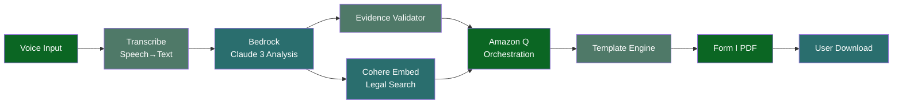

# Citadel AI: Voice-First Legal Draft Generator
## Hackathon Requirements Document

### The Problem: Justice Denied at Scale

**77% of Indians cannot access legal remedies** due to language barriers and cost constraints. With **50 million consumer complaints annually** and legal consultation fees starting at **₹5,000**, a ₹299 unauthorized charge becomes economically irrational to pursue.

**Meet Ramesh**: A shopkeeper in Lucknow facing unauthorized ₹299 monthly telecom deductions. His three options:
1. **Ignore it** → Lose ₹3,588 annually to corporate theft
2. **Hire lawyer** → Pay ₹5,000+ to recover ₹299 (net loss: ₹4,701)
3. **Navigate courts alone** → Face English legal documents, complex procedures, certain failure

**The Reality**: Complexity and cost create an access barrier that systematically favors corporations over consumers.

### Our Solution: First-Strike Legal Draft

**Core Innovation**: Bypasses legal complexity → delivers court-ready draft in **120 seconds**

**User Journey**: Voice Note → AI Transcription → Legal Analysis → Form I Generation → Ready to File

**Key Differentiator**: **We deliver a fileable legal instrument, not just advice.** Users get a complete "Form I" consumer complaint with proper legal grounds, not generic guidance.

### Target Users

**Primary**: Hindi-speaking consumers in Tier 2/3 cities
- Age: 25-60 years
- Profile: Limited English, basic smartphone use, WhatsApp-native
- Pain: Facing consumer disputes (telecom fraud, defective products, service failures)

**Secondary**: Consumer rights NGOs & legal aid clinics
- Use case: Scale assistance to underserved populations
- Impact: 10x more cases handled per legal worker

### Core Features & Technical Implementation

| Feature | User Experience | Technical Implementation | Success Metric |
|---------|----------------|-------------------------|----------------|
| **Voice-First Intake** | Records complaint in natural Hindi speech | Amazon Transcribe + Hindi language model | >85% transcription accuracy |
| **AI Strategy Adviser** | Identifies issue type, suggests legal strategy | Claude 3 via Bedrock + Consumer Protection Act knowledge | >90% correct issue classification |
| **Evidence Validator** | Asks for specific proof (SMS, receipts, dates) | Rule-based checklist + Claude 3 validation | 100% mandatory fields collected |
| **Plain-Language Law Guide** | Explains rights in conversational Hindi | Cohere Embed + vector search + Claude 3 translation | User comprehension >4/5 rating |
| **Instant Legal Draft** | Generates complete Form I with legal grounds | Claude 3 + structured templates + PDF generation | 100% court-compliant format |

### Technical Architecture

**Key Technical Decisions**:
- **Serverless**: Zero infrastructure management, instant scaling
- **Privacy First**: No permanent voice storage, 24-hour data retention
- **Cost Optimized**: Pay-per-use, target <₹5 per request
- **AWS Native**: Transcribe, Bedrock (Claude 3 + Cohere), Lambda, Q Business

**AWS Services Stack**:
- **Amazon Transcribe**: Hindi speech-to-text
- **Amazon Bedrock**: Claude 3 (reasoning) + Cohere Embed (legal search)
- **Amazon Q Business**: Workflow orchestration
- **AWS Lambda**: Serverless compute
- **Amazon S3**: Document storage
- **Amazon DynamoDB**: Session management

### Success Metrics

**For Hackathon Demo**:
- ✅ **≤120 seconds** end-to-end completion
- ✅ **Complete Form I draft** with all mandatory fields
- ✅ **Hindi voice input** working with >85% accuracy
- ✅ **<₹5 cost per request** at scale

**For Scale Impact**:
- ✅ **1M+ users** supported on serverless architecture
- ✅ **₹5,000 saved per user** (avoided lawyer fees)
- ✅ **10x faster** than traditional legal consultation

### Risks & Mitigations

| Risk | Impact | Mitigation |
|------|--------|------------|
| **Hindi speech accuracy <85%** | Core functionality fails | Pre-test diverse accents, text input fallback, confidence scoring |
| **AWS costs exceed budget** | Demo becomes expensive | Usage caps, local testing, cached responses for common scenarios |
| **Legal formatting errors** | Invalid court documents | Template validation, Consumer Protection Act compliance checks, sample human review |

### MVP Scope & Future Roadmap

**What's NOT in Hackathon MVP**:
- Multiple Indian languages (Hindi only)
- Full case management (first draft only)
- Court filing integration (manual filing required)
- Legal representation (guidance only, clear disclaimers)

**Future Roadmap**:

**Phase 1** (Post-Hackathon): WhatsApp integration, voice quality improvements  
**Phase 2** (6 months): Add more indian language support
**Phase 3** (12 months): Expand to property disputes  
**Phase 4** (18 months): Court e-filing integration

### Technical Constraints & Assumptions

**Hackathon Constraints**:
- **48-hour development window**
- **AWS free tier + $100 budget**
- **Team of 4 developers**
- **Stable demo for 15-minute presentation**

**Key Assumptions**:
- Amazon Transcribe Hindi accuracy sufficient for legal use
- Consumer Protection Act 2019 format remains stable
- Users have smartphone with microphone access
- Internet connectivity available for AWS services

### Legal & Ethical Considerations

**Disclaimers**: Clear "guidance not legal advice" messaging throughout interface
**Privacy**: Voice recordings deleted after processing, user data anonymized
**Accuracy**: All legal citations verified against Consumer Protection Act 2019
**Liability**: System provides document templates, users responsible for filing accuracy
**Compliance**: Data stored in Indian AWS regions, GDPR-equivalent privacy protection

---

**Bottom Line**: Citadel AI transforms the economics of consumer justice. Instead of choosing between ₹299 theft and ₹5,000 lawyer fees, Ramesh gets a court-ready legal draft in 120 seconds for <₹5. **This isn't legal tech—it's justice acceleration.**